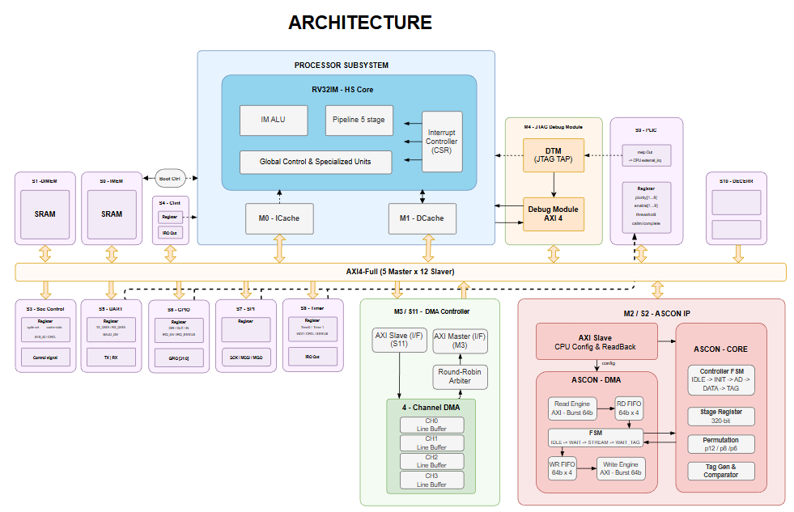
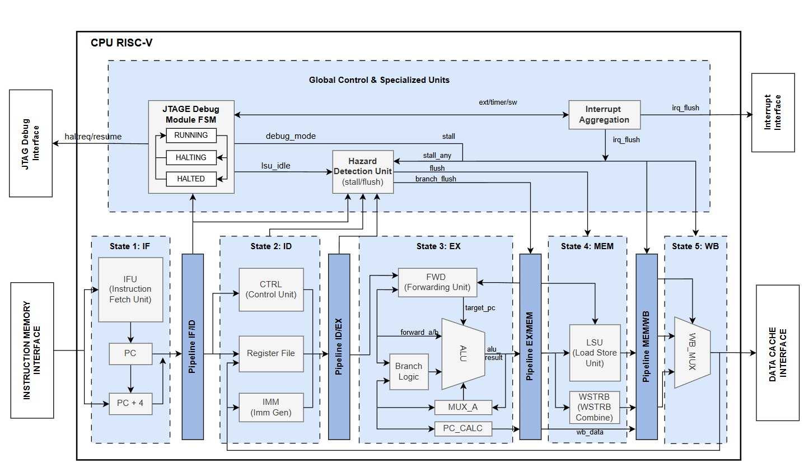

# A High-Throughput RISC-V SoC with DMA-Enabled Pipelined ASCON Engine for Efficient Secure Communications

## 1. Project Overview
This project presents a **High-Performance (High-Throughput) and Energy-Efficient 32-bit RISC-V System-on-Chip (SoC)** designed entirely from scratch. The core objective of this design is to achieve maximum data processing and cryptographic throughput while strictly managing power consumption for secure embedded and IoT applications.

The design emphasizes a tightly integrated **memory hierarchy**, a high-bandwidth **AXI4 interconnect**, and a **hardware-accelerated, DMA-enabled ASCON cryptographic engine**. 

### Key Project Pillars
| Pillar | Implementation Highlights |
|--------|---------------------------|
| **High-Throughput (HS)** | 5-stage pipelined CPU with dynamic branch prediction, Pipelined ASCON engine, dual-cache system (ICache/DCache), and AXI4-Full burst transfers. |
| **Energy Efficiency** | Fine-grained clock gating, distinct clock domains (AON, Core, Peripheral), and RISC-V `WFI` (Wait For Interrupt) deep sleep support. |
| **Secure Communications** | Native integration of ASCON (Lightweight Authenticated Encryption) to guarantee data confidentiality and integrity with minimal latency. |
| **Autonomous Operation** | Multi-channel System DMA and DMA-enabled Crypto offload massive data movement from the CPU. |

---

## 2. System Architecture


The SoC relies on a **Harvard Architecture** and an advanced **5-Master, 12-Slave AXI4 Crossbar** to prevent bus contention and maximize parallel data movement.

### High-Throughput Features
- **AXI4-Full Crossbar (5M x 12S)**: Supports concurrent transactions from multiple bus masters (ICache, DCache, ASCON-DMA, System DMA, JTAG DM).
- **Decoupled DMA Engine**: A dedicated 4-channel DMA controller allows high-speed memory-to-memory transfers independently of the CPU.
- **Hardware Cryptography**: The ASCON accelerator features its own AXI Master interface to fetch plaintext and stream ciphertext back to memory, ensuring cryptographic operations never bottleneck the CPU.

### Energy-Efficient Features (Power Management)
- **Clock & Reset Controller (`clk_reset_ctrl`)**: Implements safe, glitch-free 2-FF synchronizers for resets and dynamic clock gating across multiple domains.
- **Power Domains**:
  - **AON (Always-On) Domain**: Keeps wake-up logic (Timer timeouts, GPIO edge detects, UART RX) alive at all times.
  - **Core Domain**: CPU and Caches; completely gated during idle sleep.
  - **Peripheral Domain**: Standard peripherals; safely gated when not actively communicating.
- **WFI Sleep State**: When idle, the CPU executes the `WFI` instruction. This signals the hardware clock controller to freeze the Core clock until a PLIC/CLINT interrupt or an AON wake-event occurs, drastically reducing dynamic power consumption.

---

## 3. Register Map

The SoC features a 32-bit flat memory space. The 5M-12S AXI4 Crossbar decodes addresses to route transactions to the appropriate memory or peripheral slave.

| Slave | Module | Base Address | Address Mask | Size |
|-------|--------|--------------|--------------|------|
| **S0**  | IMEM (Instruction Memory) | `0x0000_0000` | `0xFFFF_E000` | 8 KB |
| **S1**  | DMEM (Data Memory) | `0x1000_0000` | `0xFFFF_E000` | 8 KB |
| **S2**  | ASCON Crypto Accelerator | `0x2000_0000` | `0xFFFF_F000` | 4 KB |
| **S3**  | SoC Control Registers | `0x3000_0000` | `0xFFFF_F000` | 4 KB |
| **S4**  | CLINT (Core Local Interruptor) | `0x4000_0000` | `0xFFFF_0000` | 64 KB |
| **S5**  | UART | `0x5000_0000` | `0xFFFF_F000` | 4 KB |
| **S6**  | GPIO | `0x5001_0000` | `0xFFFF_F000` | 4 KB |
| **S7**  | SPI | `0x5002_0000` | `0xFFFF_F000` | 4 KB |
| **S8**  | Timer / WDT | `0x5003_0000` | `0xFFFF_F000` | 4 KB |
| **S9**  | PLIC (Platform-Level Interrupt Ctrl) | `0x5004_0000` | `0xFFFF_F000` | 4 KB |
| **S10** | OTP Controller | `0x6000_0000` | `0xFFFF_F000` | 4 KB |
| **S11** | System DMA Controller | `0x6001_0000` | `0xFFFF_F000` | 4 KB |

---

## 4. RISC-V CPU Core


The processing heart is a custom **32-bit RISC-V RV32IM** core built for sustained high performance.

- **5-Stage Pipeline**: Instruction Fetch, Decode, Execute, Memory, and Write-Back.
- **Dynamic Branch Prediction**: Features a 256-entry Branch History Table (BHT) to minimize pipeline flushes and maximize IPC (Instructions Per Clock).
- **Fast Arithmetic**: Integrated 2-stage pipelined hardware multiplier for rapid DSP and cryptographic arithmetic.
- **Advanced Forwarding**: Solves Data Hazards dynamically without stalling the pipeline.

---

## 5. High-Performance Memory Subsystem
The memory system is structured to hide latency and sustain the high throughput required by the CPU and the ASCON engine.

- **ICache (Instruction Cache)**: 1KB, 32-byte lines. Fast read-only access for instructions.
- **DCache (Data Cache)**: 8KB, 16-byte lines. Write-Back and Write-Allocate policies minimize unnecessary AXI bus write traffic.
- **SRAM Controllers**: High-speed AXI4-Full slaves for zero-wait-state burst access to internal IMEM and DMEM.

---

## 6. Pipelined ASCON Cryptographic Accelerator
ASCON is the NIST standard for lightweight cryptography. This SoC integrates a custom **Pipelined ASCON Engine** optimized for both speed and power.

- **Autonomous DMA Mode**: The accelerator is not just a passive MMIO peripheral. It features a built-in DMA engine (AXI4 Master) that autonomously pulls data, processes it through the ASCON permutation core, and writes tags/ciphertext back to memory.
- **CPU Offloading**: The CPU simply configures the Keys, Nonces, and memory pointers, issues a START command, and immediately goes to sleep (`WFI`). The ASCON engine processes the data in the background and fires a PLIC interrupt when the secure communication packet is ready.

---

## 7. SoC Peripherals & Debugging
The SoC is equipped with a full suite of industrial-standard peripherals to support robust firmware development and real-world interfacing.

- **CLINT (Core Local Interruptor)**: Handles precise internal Timer and Software interrupts.
- **PLIC (Platform-Level Interrupt Controller)**: Aggregates external interrupt sources (UART, GPIO, Timers, System DMA, ASCON) and routes them safely to the CPU.
- **JTAG Debug Module**: Full RISC-V Debug specification support (DTM + DM). Allows developers to halt the CPU, inspect registers, inject instructions, and load programs directly over standard JTAG.
- **Communication & IO**: UART (with Hardware Bootloader capabilities), 32-bit GPIO, Timers, and Watchdog (WDT).

---

## 8. Directory Structure

```
SoC_RISC-V/
├── ascon/           # Pipelined ASCON Crypto Accelerator with DMA
├── boot/            # Hardware UART Bootloader
├── cache_interface/ # L1 Instruction and Data Caches (AXI4 Masters)
├── clk_reset_ctrl/  # Glitch-free clock gating and AON power management
├── cpu/             # RISC-V RV32IM 5-Stage Pipelined Core
├── dma/             # 4-Channel AXI4 System DMA Controller
├── interconnect/    # 5-Master x 12-Slave AXI4 Crossbar
├── jtag/            # RISC-V JTAG Debug Module (DTM & DM)
├── memory/          # AXI4-Full SRAM Controllers (IMEM/DMEM)
├── peripheral/      # Timers, WDT, GPIO, UART, SPI
├── plic/            # Platform-Level Interrupt Controller
└── soc_top.v        # Top-level SoC Integration
```

---

## 9. Simulation & Verification
Verification is a first-class citizen in this project, ensuring high reliability for hardware fabrication.

| Tool | Purpose |
|------|---------|
| **Icarus Verilog** | RTL Simulation and Compilation |
| **GTKWave** | Waveform Debugging |
| **Make / Shell Scripts** | Build automation (`run_verilog.sh`, `lint_verilog.sh`) |

To run a simulation:
```bash
# Linux
./workflow/lrun_verilog.sh /soc_top/tb/tb_soc_top.v   

# Windows
./workflow/wrun_verilog.bat /soc_top/tb/tb_soc_top.v 
```

---

## 10. System Requirements
- **Simulation**: Icarus Verilog (≥ 11.0), GTKWave (≥ 3.3), Make.
- **FPGA Prototyping**: Target independent (Xilinx Vivado or Intel Quartus). Requires standard 32-bit FPGA block RAM resources for Caches and Memory.

---

## 11. Author & Contact
- **Project Title**: A High-Throughput RISC-V SoC with DMA-Enabled Pipelined ASCON Engine for Efficient Secure Communications
- **Author**: Đỗ Trần Chí Thắng (ChiThang)
- **Role**: SoC Architecture, RTL Design, Verification, Firmware, Synthesis, FPGA Implementation
- **Contact**: dodotranchithang2k5@gmail.com

**License**: Distributed under the [MIT License](LICENSE).  
**Status**: 🚀 Active Development (February 2026)
