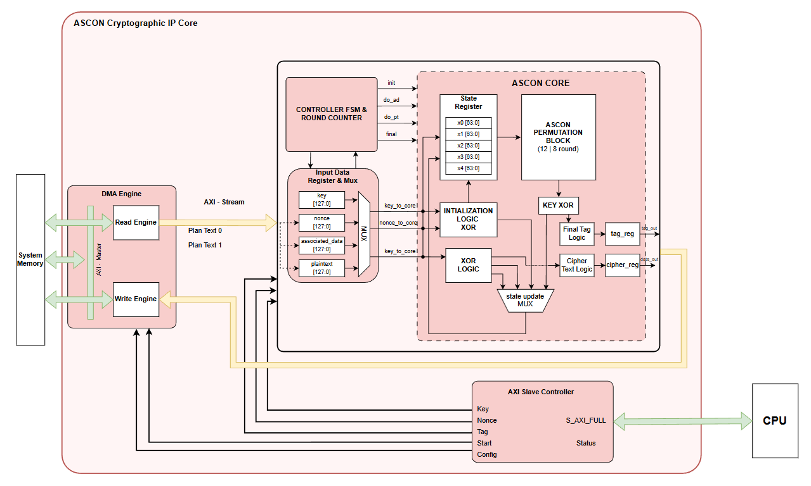

# ASCON Crypto Accelerator IP

## 1. Overview
The ASCON Crypto Accelerator IP is a hardware implementation of the ASCON Authenticated Encryption with Associated Data (AEAD) algorithm. It provides secure, high-throughput encryption and decryption for data. 

In a SoC, this IP sits on the high-speed system bus (via AXI4-Full), connected as both a peripheral for the CPU to control and as a bus master (DMA) to independently fetch data from memory.

It is needed to offload complex cryptographic operations from the CPU, significantly reducing processing time and system latency while providing robust security for embedded systems and IoT devices.

---

## 2. Features
- **Bus Interface:** Dual AXI4-Full interfaces (one Slave, one Master).
- **Master or Slave:** Acts as both a Slave (for CPU configuration) and a Master (for autonomous DMA data transfers).
- **Key Capabilities:**
  - **Dual Operation Modes:** Supports CPU-Direct mode (CPU writes data directly) and DMA mode (fetches data automatically from DDR).
  - **Algorithm Variants:** Supports both ASCON-128 and ASCON-128a (configurable via register).
  - **Hardware Interrupts:** Generates an `irq` signal upon task completion or error for non-blocking CPU operation.
  - **Burst Transfer Support:** Supports INCR burst from the CPU for fast Key/Nonce loading, and configurable burst lengths for DMA memory access.
  - **Internal Buffering:** Utilizes 64-bit Read FIFOs and 32-bit Write FIFOs in the DMA engine to stream data efficiently.

---

## 3. Block Diagram

- **AXI Slave (`ascon_axi_slave`)**: Handles configuration registers and control logic from the CPU.
- **ASCON Core (`ascon_CORE`)**: The main cryptographic engine containing the datapath, permutation logic, and state registers.
- **DMA Controller (`ascon_dma`)**: The AXI Master engine that reads plaintext from memory, feeds it to the core, and writes the ciphertext/tag back to memory.

---

## 4. Interface

### 4.1 Clock & Reset
- `clk`: System clock. Drives the entire IP, including the core and bus interfaces.
- `rst_n`: Active-low asynchronous reset. Resets the internal states and FSMs.

### 4.2 Bus Interface
- **AXI4-Full Slave (`S_AXI_*`)**: Allows the CPU to configure the IP, load Keys/Nonces, and start operations. It handles AXI read/write transactions including INCR bursts.
- **AXI4-Full Master (`M_AXI_*`)**: Used by the DMA engine to autonomously stream plaintext from system memory (DDR/SRAM) and write back ciphertext/tags, bypassing the CPU.

### 4.3 Key Signals

| Signal | Direction | Description |
|--------|----------|-------------|
| `S_AXI_*` | Input/Output | AXI4-Full Slave signals for CPU access |
| `M_AXI_*` | Input/Output | AXI4-Full Master signals for DMA access |
| `o_tag` | Output | 128-bit Authentication Tag (parallel output) |
| `o_tag_valid` | Output | Asserts when the parallel `o_tag` is ready |
| `o_busy` | Output | High when the Core or DMA is currently processing |
| `irq` | Output | Interrupt request line, triggered on completion or error |

---

## 5. Register Map (if exists)

This IP provides a comprehensive register map for software configuration. Address offsets are 12-bit wide.

| Address | Name | Description |
|--------|------|-------------|
| `0x000` | `MODE` | [1] Direction: 0=Encrypt, 1=Decrypt. [0] Variant: 0=ASCON-128, 1=ASCON-128a. |
| `0x004` | `STATUS` | (RO) Sticky bits for: [5] DMA Err, [4] Core Err, [3] DMA Done, [2] DMA Busy, [1] Core Done, [0] Core Busy. |
| `0x00C` | `IRQ_EN` | Enables interrupts: [2] Errors, [1] DMA Done, [0] Core Done. |
| `0x010` - `0x01C` | `KEY_[0-3]` | 128-bit Encryption/Decryption Key. |
| `0x020` | `CTRL` | [2] DMA_EN (1=DMA mode, 0=CPU mode), [1] SOFT_RST, [0] START pulse. |
| `0x024` - `0x030` | `NONCE_[0-3]`| 128-bit Nonce. |
| `0x034` - `0x038` | `PTEXT_[0-1]`| 64-bit Plaintext input (used in CPU-Direct mode). |
| `0x03C` | `DATA_LEN` | Actual byte length of the plaintext/data block. |
| `0x040` - `0x044` | `CTEXT_[0-1]`| 64-bit Ciphertext output. |
| `0x048` - `0x054` | `TAG_[0-3]` | 128-bit Authentication Tag output. |
| `0x100` | `DMA_SRC` | DMA Source Address (Plaintext in memory). |
| `0x104` | `DMA_DST` | DMA Destination Address (Ciphertext/Tag out in memory). |
| `0x108` | `DMA_LEN` | DMA transfer byte length. |
| `0x114` | `DMA_BURST` | AXI Burst Length for DMA transfers (0 = 1 beat). |

**Software Usage:**
Software typically configures `MODE`, loads the `KEY` and `NONCE` (using standard writes or memcpy bursts), and sets up `DATA_LEN`. If using DMA, software configures the DMA addresses (`DMA_SRC`, `DMA_DST`, `DMA_LEN`, `DMA_BURST`). Finally, it writes to `CTRL` to set `DMA_EN` and trigger `START`. Software can then wait for an interrupt instead of polling `STATUS`.

---

## 6. Internal Architecture

- **AXI Slave Interface (`ascon_axi_slave`)**: Contains the memory-mapped registers, decodes incoming AXI4 transactions, and correctly routes INCR bursts for multi-word setups (like Keys).
- **Core Engine (`ascon_CORE`)**: Contains the ASCON FSM (`CONTROLLER`), the state register (`STATE_REGISTER`), and the arithmetic/logic blocks (`PERMUTATION`, `DATAPATH`, `TAG_GENERATOR`). It processes the data in discrete rounds.
- **DMA Engine (`ascon_dma`)**: Features dedicated Read and Write sub-engines. It uses asynchronous FIFOs to buffer data between the AXI Master bus and the ASCON Core, ensuring smooth streaming and handling AXI protocol handshakes autonomously.

---

## 7. Timing / Operation Flow

**Step-by-step Execution (DMA Mode):**
1. **Configure**: CPU sets `KEY`, `NONCE`, `MODE`, and `DATA_LEN` via AXI Slave.
2. **Setup Memory**: CPU configures `DMA_SRC`, `DMA_DST`, and `DMA_LEN`.
3. **Start**: CPU writes to `CTRL` (setting `DMA_EN` = 1 and `START` = 1).
4. **Processing**:
   - The DMA Read Engine issues AXI read requests to fetch data from `DMA_SRC` into the internal RD FIFO.
   - The ASCON Core pulls data from the RD FIFO, processes it (initialization, absorption, squeezing), and pushes ciphertext to the WR FIFO.
   - Once all data is processed, the Core generates the final Tag and pushes it to the WR FIFO.
   - The DMA Write Engine bursts the contents of the WR FIFO back to `DMA_DST`.
5. **Done**: The IP asserts the `irq` signal, and sticky completion bits are set in the `STATUS` register.

---

## 8. Integration Guide

- **Bus Connections**: Connect `S_AXI` to the SoC's peripheral interconnect (for MMIO). Connect `M_AXI` to the SoC's main memory crossbar (to access DDR or SRAM).
- **Clocks and Resets**: Provide a stable system clock (`clk`) and a synchronized active-low reset (`rst_n`).
- **Interrupt Controller**: Connect the `irq` output to the SoC's interrupt controller (e.g., PLIC) to allow firmware to use interrupt-driven cryptographic operations.
- **Data Coherency**: When using DMA mode, the software driver must flush the CPU data cache (or use non-cacheable memory) before starting the engine to ensure the DMA reads the correct plaintext from memory.

---

## 9. Limitations

- **Alignment**: The software driver must ensure that DMA source and destination addresses are correctly aligned to 8-byte boundaries.
- **DMA Boundaries**: The current Phase 1 DMA relies on single 64-bit (8-byte) blocks internally; large streams require configuring the burst length carefully.
- **S-Box Pipelining**: Currently, `G_SBOX_PIPELINE` is forced to 0 (combinational) as per `ascon_top` parameters, meaning the permutation round timing heavily dictates the Fmax limit.
- **AXI-Stream**: Streaming over AXI-Stream is removed in this version in favor of direct DMA memory-mapping.

---

## 10. Author

- Name: Đỗ Trần Chí Thắng
- Role: SoC Architecture, RTL Design, Verification, Firmware, Synthesis, FPGA Implementation
