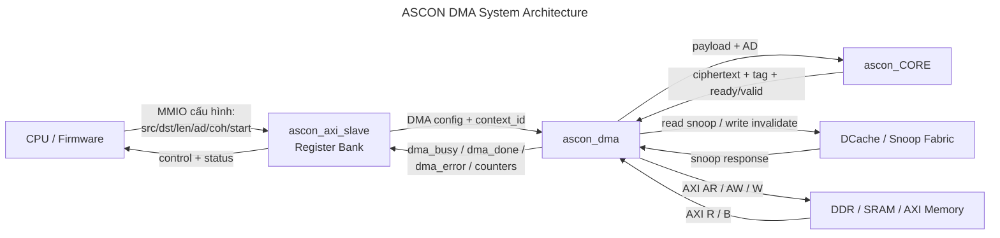
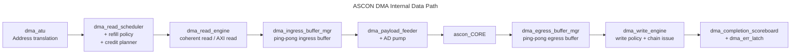

# Đặc Tả Kiến Trúc DMA ASCON

Tài liệu này mô tả kiến trúc hệ thống của `ascon_dma` theo hướng dùng làm `spec`.

Mục tiêu của bản này là:

- nhìn rõ sơ đồ khối cấp hệ thống
- nhìn rõ datapath chính
- tách rõ `data path`, `control path`, `coherency path`
- giữ đúng tinh thần kiến trúc hiện tại nhưng bỏ bớt chi tiết quá sâu của RTL debug

## 1. Mục tiêu kiến trúc

`ascon_dma` được xây dựng để biến ASCON từ một accelerator điều khiển kiểu phase-based sang một datapath streaming có khả năng overlap:

- đọc dữ liệu từ memory bằng DMA
- đệm dữ liệu theo kiểu ping-pong
- feed dữ liệu vào `ascon_CORE`
- thu ciphertext/tag
- ghi kết quả trở lại memory bằng DMA
- hỗ trợ coherence có chọn lọc theo hướng dữ liệu

Kiến trúc này phục vụ ba mục tiêu chính:

1. giảm sự can thiệp của CPU/firmware vào datapath bulk
2. tạo overlap giữa `read -> process -> write`
3. giữ một mode hiệu năng cao và một mode coherence đầy đủ tách biệt

## 2. Sơ đồ khối hệ thống



## 3. Sơ đồ datapath nội bộ

Đây là sơ đồ nên dùng khi trình bày lõi ý tưởng của DMA.



## 4. Các miền chức năng chính

### 4.1 Control plane

Khối điều khiển gồm:

- `ascon_axi_slave`
- `dma_ctrl_fsm`
- `dma_completion_scoreboard`
- `dma_err_latch`

Vai trò:

- nhận cấu hình từ firmware
- khởi động transaction
- theo dõi trạng thái `busy/done/error`
- xuất counters và error address

Control plane không phải là nơi tạo throughput chính. Nó chỉ tổ chức transaction và khóa contract giữa firmware với datapath.

### 4.2 Read path

Khối read path gồm:

- `dma_atu`
- `dma_read_scheduler`
- `dma_read_refill_policy`
- `dma_read_bank_credit_planner`
- `dma_read_engine`
- `dma_ingress_buffer_mgr`

Vai trò:

- sinh địa chỉ đọc sau dịch địa chỉ qua `ATU`
- quyết định khi nào cần refill
- phát read theo kiểu credit-based
- hỗ trợ coherent read bằng snoop nếu bật policy đọc
- đổ dữ liệu vào ingress ping-pong buffer

Ý tưởng kiến trúc:

- không chỉ đọc xong burst này rồi mới nghĩ tới burst tiếp theo
- phải nhìn được backlog của bank đang fill/drain
- phải tận dụng được nhiều read outstanding ở steady-state

### 4.3 Core feed path

Khối core feed gồm:

- `dma_payload_feeder`
- `AD pump`
- giao diện ready/valid với `ascon_CORE`

Vai trò:

- lấy dữ liệu từ ingress buffer
- tách luồng `AD` và `payload`
- feed đúng nhịp vào `ascon_CORE`

Đây là điểm nối giữa DMA streaming path và crypto core. Nó quyết định mức độ “trơn” của luồng dữ liệu, đặc biệt khi core có backpressure.

### 4.4 Write path

Khối write path gồm:

- `wr_push` logic
- `dma_egress_buffer_mgr`
- `dma_write_drain_policy`
- `dma_write_bank_credit_planner`
- `dma_write_engine`

Vai trò:

- nhận ciphertext/tag từ `ascon_CORE`
- đệm kết quả qua egress ping-pong buffer
- lên lịch drain theo backlog và trạng thái bank
- phát write burst ra memory
- hỗ trợ coherent output theo chính sách write invalidate

Ý tưởng kiến trúc:

- write path không nên bị khóa cứng hoàn toàn bởi `BVALID`
- cần có `chain issue` để tiếp tục drain tốt hơn trong steady-state

### 4.5 Coherency path

Khối coherency gồm:

- snoop request từ `dma_read_engine`
- snoop request từ `dma_write_engine`
- `dma_snoop_arb`
- snoop fabric / dcache phía SoC

Vai trò:

- đảm bảo dữ liệu đầu vào đọc được là đúng khi source còn nằm trong cache
- đảm bảo output đúng contract cache ở các mode coherence khác nhau

Điểm quan trọng của kiến trúc này là:

- coherence không đối xử giống nhau cho mọi hướng dữ liệu
- read side và write side có thể dùng policy khác nhau

## 5. Luồng dữ liệu chuẩn

Một transaction đầy đủ có thể được nhìn như sau:

```text
1. Firmware ghi src_addr, dst_addr, byte_len, ad_src_addr, ad_len, coh_ctrl
2. Firmware ghi start
3. Read scheduler phát các đợt read cho AD và payload
4. Read engine lấy dữ liệu từ memory hoặc từ snoop path
5. Ingress ping-pong buffer giữ dữ liệu để che latency AXI
6. Payload feeder / AD pump đưa dữ liệu vào ascon_CORE
7. ascon_CORE sinh ciphertext và tag
8. Egress ping-pong buffer gom output và tạo backlog cho write path
9. Write engine drain kết quả về memory
10. Scoreboard chốt done/error và trả trạng thái về register bank
```

## 6. Tổ chức pipeline của datapath

Datapath hiện tại được thiết kế theo kiểu pipeline ở mức hệ thống:

```text
Memory Read
  -> Ingress Buffer
  -> Core Feed
  -> ASCON Core
  -> Egress Buffer
  -> Memory Write
```

Điểm cần hiểu đúng:

- đây là `streaming / overlap pipeline`
- không phải mọi stage đều “mỗi cycle ra một output” hoàn toàn lý tưởng
- nhưng kiến trúc đã đủ để cho phép overlap giữa `read`, `process`, và `write`

Các cơ chế tạo pipeline/overlap:

- ping-pong ingress buffering
- ping-pong egress buffering
- credit-based read refill
- chain issue ở write path
- tách policy scheduler/planner thành submodule độc lập

## 7. Các policy kiến trúc quan trọng

### 7.1 Read refill policy

Read side không chỉ dựa vào `fifo_count` tổng.

Nó cần nhìn:

- bank nào đang `fill`
- bank nào đang `drain`
- fill bank đã “đủ dữ liệu” chưa
- drain bank có đang gần cạn không

Mục tiêu:

- refill sớm trước khi drain bank cạn
- giảm bubble giữa read side và core feed

### 7.2 Write drain policy

Write side không chỉ đợi có dữ liệu rồi mới ghi.

Nó cần nhìn:

- drain bank ready
- fill bank backlog
- urgency của burst kế tiếp
- số response đang pending

Mục tiêu:

- drain đều hơn trong steady-state
- tránh để output backlog dồn lại quá lâu

### 7.3 Direction-aware coherence

`coh_ctrl` tách logic coherence theo hướng:

- read side: quyết định có dùng snoop read hay không
- write side: quyết định có dùng invalidate/write coherence hay không

Nhờ vậy kiến trúc có thể tồn tại các mode:

- mode hiệu năng cao
- mode coherence đầy đủ

## 8. Các giao diện ngoài quan trọng

### 8.1 Firmware-visible interface

Firmware nhìn thấy:

- `src_addr`
- `dst_addr`
- `byte_len`
- `burst_len`
- `ad_src_addr`
- `ad_len`
- `atu_base`
- `atu_window`
- `coh_ctrl`
- `dma_start`
- `dma_soft_rst`
- `dma_busy`
- `dma_done`
- `dma_error`
- `dma_err_addr`

### 8.2 Core-visible interface

`ascon_CORE` nhìn thấy:

- payload input
- AD input
- `start`
- `last`
- `ready/valid`
- ciphertext output
- tag output

### 8.3 Memory-visible interface

Memory subsystem nhìn thấy:

- AXI read address/data
- AXI write address/data/response

### 8.4 Cache-coherency-visible interface

Snoop fabric nhìn thấy:

- snoop read request
- snoop invalidate request
- snoop response valid/hit/data

## 9. Những điểm cần giữ chặt trong spec

Khi dùng tài liệu này làm đặc tả, nên giữ chặt các điểm sau:

1. `H3` chỉ là reference control-plane, không phải headline datapath
2. datapath chính của `H` là `streaming DMA path`
3. datapath phải được mô tả theo hướng overlap `read -> core -> write`
4. coherence phải được mô tả theo hướng `direction-aware`, không nói chung chung
5. ping-pong buffering là phần cốt lõi của kiến trúc, không phải chi tiết phụ
6. read planner và write planner là thành phần kiến trúc, không phải chỉ là tối ưu nhỏ

## 10. Tóm tắt ngắn để chèn vào tài liệu khác

Có thể dùng đoạn sau khi cần mô tả nhanh:

> `ascon_dma` là một DMA streaming subsystem cho ASCON, trong đó read side, buffering, core feed, core processing, và write side được tổ chức theo datapath overlap có ping-pong buffering và coherence có chọn lọc theo hướng dữ liệu. Kiến trúc này nhằm giảm phụ thuộc vào software fence, tăng khả năng duy trì throughput cao ở mode hiệu năng, đồng thời vẫn giữ một mode coherence đầy đủ cho correctness đầu ra.
