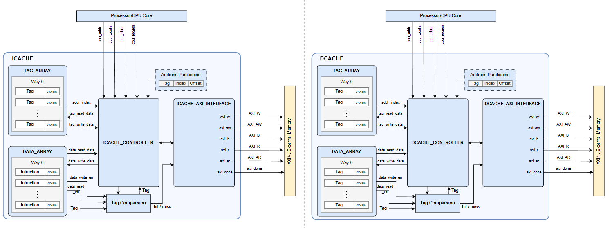

# Cache Interface Subsystem (ICache & DCache)

## 1. Overview
The Cache Interface subsystem provides the essential memory caching layers between the RISC-V CPU core and the main system memory (via the AXI4-Full crossbar). It consists of two distinct cache modules:
- **ICache (Instruction Cache)**: Optimized for rapidly fetching instruction words.
- **DCache (Data Cache)**: Optimized for handling data loads and stores with write-back functionality.

In the SoC architecture, these caches sit directly beside the CPU. They act as high-speed intermediaries that service CPU requests immediately on a cache hit, or autonomously fetch/evict data over the AXI4 system bus on a cache miss, significantly reducing memory access latency and improving overall system performance.

---

## 2. Features
- **Bus Interface**: AXI4-Full Master interfaces (M0 for ICache, M1 for DCache).
- **Master or Slave**: Master (initiates memory read/write requests to the system crossbar).
- **Key Capabilities**:
  - **Instruction Cache (ICache)**:
    - Size: 1KB (configurable).
    - Line Size: 32 Bytes (8 words).
    - Read-Only: Write AXI channels are safely tied off in hardware to prevent invalid instruction memory writes.
  - **Data Cache (DCache)**:
    - Size: 8KB (configurable).
    - Line Size: 16 Bytes (4 words).
    - Policy: Write-Back + Write-Allocate, minimizing unnecessary bus traffic.
  - **Coherency & Flushing**: Supports explicit flush requests from the CPU (`fence_type` for DCache to flush dirty lines or invalidate; `flush` for ICache).
  - **Performance Monitoring**: Features real-time `stat_hits`, `stat_misses` counters (and `stat_writes` for DCache) to evaluate cache efficiency.

---

## 3. Block Diagram

- **CPU Core**: Issues `cpu_req`, `cpu_addr`, and data to the caches.
- **ICache / DCache Controllers**: The FSMs that manage hits/misses, direct the AXI interface to refill or evict lines, and stall the CPU via `cpu_ready`.
- **Tag & Data Arrays**: Internal SRAM blocks holding the cached data and metadata (Valid, Dirty, Tags).
- **AXI4 Interfaces (`icache_axi_interface`, `dcache_axi_interface`)**: Handle AXI4 burst transactions to efficiently fill or flush entire cache lines.

---

## 4. Interface

### 4.1 Clock & Reset
- `clk`: System operating clock.
- `rst_n`: Active-low asynchronous reset.

### 4.2 Bus Interface
- **AXI4-Full Master (M0 / M1)**: Used by the Cache Controllers to communicate with the main memory crossbar.

### 4.3 Key Signals (CPU Side)

| Signal | Direction | Description |
|--------|----------|-------------|
| `cpu_req` | Input | High when the CPU requests a memory access. |
| `cpu_we` | Input | (DCache only) Write Enable flag. |
| `cpu_addr` | Input | 32-bit memory address requested by the CPU. |
| `cpu_wdata` | Input | (DCache only) 32-bit data to write. |
| `cpu_rdata` | Output | 32-bit data returning to the CPU. |
| `cpu_ready` | Output | High when the cache is ready or has completed the request (used to stall the CPU pipeline). |
| `fence_type` | Input | (DCache only) [0]=flush-dirty, [1]=invalidate-read for `FENCE` instructions. |
| `flush` | Input | (ICache only) Invalidates all cache lines. |

---

## 5. Register Map (if exists)

The Caches do not present a memory-mapped register interface to the CPU. They act as transparent hardware accelerators that intercept standard memory accesses.

---

## 6. Internal Architecture

Each Cache is composed of four primary sub-modules:
- **Controller (`_controller`)**: The main State Machine orchestrating lookups, hits, and directing misses to the AXI interface.
- **Tag Array (`_tag_array`)**: Stores the upper bits of the address and state bits (Valid, Dirty) for each cache line.
- **Data Array (`_data_array`)**: The actual SRAM block storing the 32-bit words.
- **AXI Interface (`_axi_interface`)**: Converts internal `refill` and `evict` requests into standard AXI4 burst transactions.

*Note: DCache employs a Write-Back policy. When a write hit occurs, only the cache is updated (and marked Dirty). Main memory is only updated when a dirty line is later evicted or a `FENCE` forces a flush.*

---

## 7. Timing / Operation Flow

**Cache Read/Write Scenario:**
1. **Request**: CPU asserts `cpu_req` and `cpu_addr`. The cache pulls `cpu_ready` low to stall the CPU pipeline.
2. **Lookup**: The Controller queries the Tag Array using the address index.
3. **Hit**: If the Tag matches and Valid is high:
   - *Read*: The Data Array returns the requested word immediately. `cpu_ready` is asserted.
   - *Write (DCache)*: The Data Array is updated, and the Tag Array is marked Dirty. `cpu_ready` is asserted.
4. **Miss**: If the Tag mismatches or Valid is low:
   - *Eviction (DCache)*: If the existing line is Dirty, the Controller initiates an AXI Write burst (`evict`) to save it to main memory.
   - *Refill*: The Controller initiates an AXI Read burst (`refill`) to fetch the new line from memory.
   - *Update*: The Tag and Data Arrays are populated with the new line.
   - *Resume*: The stalled CPU request is serviced, and `cpu_ready` is asserted.

---

## 8. Integration Guide
- Instantiate both `icache_top` and `dcache_top` directly adjacent to the RISC-V CPU Core.
- Connect the `cpu_*` signals to the corresponding instruction and data memory interfaces of the CPU.
- Connect the AXI4 Master ports (`mem_*`) to two distinct Master ports on the SoC AXI Crossbar (e.g., M0 for ICache, M1 for DCache).
- Ensure the CPU's `FENCE` instruction logic correctly drives the `flush` and `fence_type` signals to maintain memory coherency.

---

## 9. Limitations
- **L1 Only**: Currently operates as an L1 cache system without an L2 backing store.
- **Non-Cacheable Memory**: The `refill_nc` (Non-Cacheable Bypass) signal is implemented but requires proper SoC-level address decoding to ensure memory-mapped I/O (MMIO) regions bypass the cache.
- **Direct-Mapped Style**: Performance depends heavily on address layout; highly associative workloads may experience thrashing.

---

## 10. Author
- Name: Đỗ Trần Chí Thắng
- Role: SoC Architecture, RTL Design, Verification, Firmware, Synthesis, FPGA Implementation
