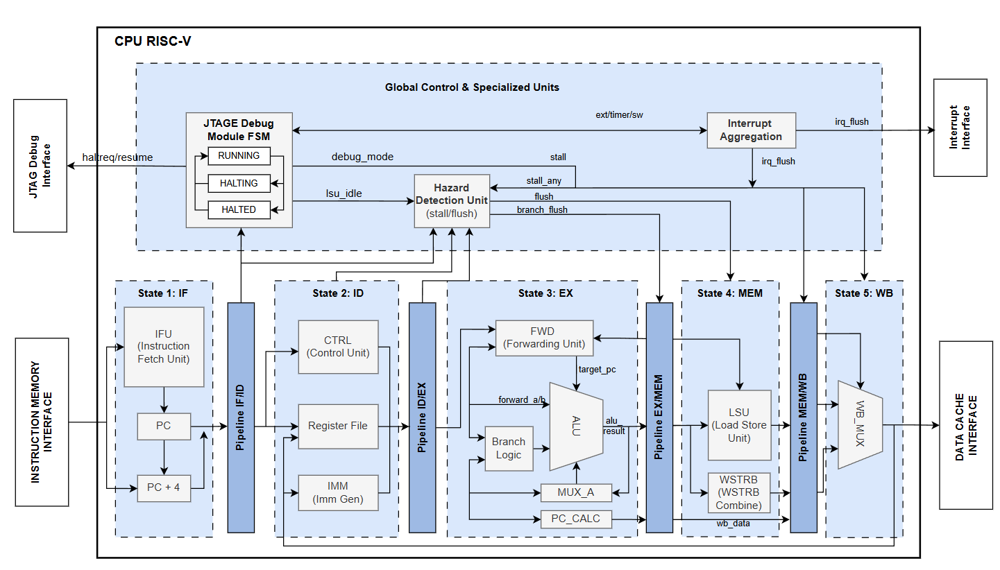

# RISC-V CPU Core

## 1. Overview
The RISC-V CPU Core is a 32-bit hardware processor implementing the standard RISC-V instruction set architecture. It features a fully-pipelined, 5-stage microarchitecture optimized for performance and control flow efficiency.

In a SoC, this IP sits as the central processing unit. It connects directly to the Instruction Cache (ICache) and Data Cache (DCache), which interface with the main system bus. It also integrates with the system's JTAG Debug Module and Interrupt Controllers (PLIC/CLINT).

It is needed to execute firmware, orchestrate peripheral devices (like DMA and Crypto Accelerators), and serve as the main brain of the system.

---

## 2. Features
- **Bus Interface**: Custom memory access interfaces (`imem` and `dcache`) designed to be attached to Cache controllers or memory wrappers.
- **Master or Slave**: Master (initiates instruction fetches and data load/store requests).
- **Key Capabilities**:
  - **5-Stage Pipeline**: Instruction Fetch (IF), Instruction Decode (ID), Execute (EX), Memory (MEM), and Write Back (WB).
  - **Dynamic Branch Prediction**: Integrated 2-bit Branch History Table (BHT) with 256 entries for optimized control flow.
  - **Hardware Multiplier**: 2-stage pipelined multiplier isolated from the main ALU critical path.
  - **Debug Support**: Fully supports JTAG debug interface (`haltreq`, `resumereq`, `halted`, `running`) allowing a debugger to freeze the pipeline safely.
  - **Interrupt Handling**: Safely aggregates external, timer, and software interrupts using 2-FF CDC synchronizers to prevent metastability across clock domains.
  - **Power Management**: Supports the `WFI` (Wait for Interrupt) instruction to freeze the pipeline and save power when idle.

---

## 3. Block Diagram

- **IFU (Instruction Fetch Unit)**: Fetches instructions from IMEM and manages the Program Counter.
- **ID (Instruction Decode & Register File)**: Decodes instructions, reads register operands, and pre-computes branch targets.
- **EX (Execution Unit)**: Contains the ALU, Branch Logic, and a Pipelined Multiplier.
- **MEM (Load/Store Unit - LSU)**: Handles data memory reads/writes, byte-lane alignment, and `FENCE` operations.
- **Pipeline Registers & Forwarding Unit**: Manages data flow between stages and resolves Data Hazards without stalling when possible.

---

## 4. Interface

### 4.1 Clock & Reset
- `clk`: Core operating clock.
- `rst`: Synchronous reset (active-high).

### 4.2 Bus Interface
- **Instruction Memory (IMEM)**: `imem_addr`, `imem_valid`, `imem_rdata`, `imem_ready`. Used to fetch 32-bit instructions.
- **Data Memory (DCache)**: `dcache_addr`, `dcache_wdata`, `dcache_wstrb`, `dcache_req`, `dcache_we`, `dcache_rdata`, `dcache_ready`, `dcache_fence_type`. Used for load and store operations.

### 4.3 Key Signals

| Signal | Direction | Description |
|--------|----------|-------------|
| `external_irq`, `timer_irq`, `sw_irq` | Input | Interrupt lines from PLIC/CLINT. Synchronized internally. |
| `debug_haltreq` / `debug_resumereq` | Input | JTAG Debug Module requests to halt or resume the CPU. |
| `debug_halted` / `debug_running` | Output | CPU state feedback to the JTAG Debug Module. |
| `cpu_wfi_o` | Output | High when the CPU is in `WFI` (Wait for Interrupt) power-saving mode. |

---

## 5. Register Map (if exists)

This IP does not use a memory-mapped register map. 
It utilizes standard internal RISC-V General Purpose Registers (x0-x31) and CSRs for internal state management.

---

## 6. Internal Architecture
- **Pipeline Registers**: Cleanly separate the 5 pipeline stages (`IF/ID`, `ID/EX`, `EX/MEM`, `MEM/WB`) using modularized IP blocks.
- **Forwarding Unit**: Implements advanced data forwarding from the MEM and WB stages directly into the EX stage ALU to resolve Data Hazards efficiently without wasting clock cycles.
- **Hazard Detection Unit**: Freezes the pipeline (stalls IF/ID) automatically when a load-use hazard occurs.
- **Debug FSM**: A dedicated state machine that safely drains the pipeline and LSU before entering `DBG_HALTED` mode. This ensures no in-flight memory transactions are corrupted when a debugger pauses execution.

---

## 7. Timing / Operation Flow
1. **Fetch**: The IFU requests an instruction from the IMEM interface.
2. **Decode**: The instruction is decoded. If it's a branch, the BHT dynamically predicts whether it will be taken.
3. **Execute**: The ALU performs arithmetic or address calculations. Multiplications are routed to the 2-stage multiplier.
4. **Memory Access**: The LSU translates memory requests into DCache interface signals, managing byte-lane strobes and executing `FENCE` signals if required.
5. **Write Back**: Loaded data, ALU results, or multiplier outputs are written back into the Register File.

**Interrupts and Debug Halts**: 
When an asynchronous interrupt or `haltreq` is detected, the core finishes executing any active load/store transactions to maintain memory coherency, flushes the earlier pipeline stages, and enters the appropriate trap handler or frozen debug state.

---

## 8. Integration Guide
- Connect the `imem_*` ports directly to the Instruction Cache or an AXI instruction memory wrapper.
- Connect the `dcache_*` ports directly to the Data Cache or an AXI data memory wrapper.
- Connect the IRQ signals (`external_irq`, `timer_irq`, `sw_irq`) to the system's interrupt controllers (e.g., PLIC and CLINT).
- Wire the debug signals (`debug_*`) to the JTAG Debug Module (RISC-V DM).
- Ensure the `cpu_wfi_o` signal is used by the SoC power controller if power-saving modes are desired.

---

## 9. Limitations
- **No Native AXI Master**: The CPU does not output AXI4 directly; it relies on external wrappers (like Cache controllers) to translate its custom `imem`/`dcache` signals to standard AXI4 transactions.
- **Multiplier Latency**: The hardware multiplier has a fixed 2-cycle latency. Instructions immediately following a multiplication that depend on its result will experience a pipeline stall.
- **FENCE Complexity**: Depending on the memory subsystem attached, `FENCE.I` instructions may require broader cache invalidation logic outside the core.

---

## 10. Author
- Name: Đỗ Trần Chí Thắng
- Role: SoC Architecture, RTL Design, Verification, Firmware, Synthesis, FPGA Implementation
