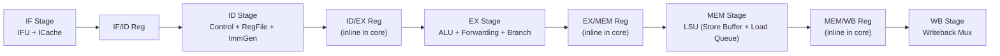

# Tối ưu RISC-V CPU Core cho High-Frequency Physical Design

## Bối cảnh

CPU core hiện tại (`riscv_cpu_core_v2.v`) chỉ đạt ~50MHz trên physical design. Mục tiêu: clean code & tối ưu kiến trúc để đạt tần số tối đa (target ≥ 100MHz trên technology hiện tại).

## Phân tích Kiến trúc Hiện tại

### Pipeline Structure: 4-stage (IF → ID → EX → MEM/WB merged)



### Tổng kết các vấn đề Critical Path (gây ra Fmax thấp)

---

## Vấn đề #1: ALU — Multiplier 32×32 Combinational

> [!CAUTION]
> **Root Cause chính của tần số thấp**

[alu.v](file:///home/chithang/Project/Design_SoC_RISCV_ASCON/cpu/core/alu.v) dùng phép nhân `*` thuần combinational:

```verilog
assign mul_result_signed   = in1_signed * in2_signed;   // 32×32 = 64-bit!
assign mul_result_unsigned = in1 * in2;                  // thêm 1 MUL nữa
```

- **Cả 2 multiplier 32×32→64 luôn tính** bất kể `alu_control` là gì
- Trên ASIC, combinational multiplier 32×32 tạo delay ~15-20ns → **chỉ riêng nó đã giới hạn Fmax ≤ 50-66MHz**
- Hai phép nhân tồn tại song song → synthesis phải instantiate 2 multiplier → tăng area, tăng routing congestion

**Giải pháp:**
1. Gộp thành 1 multiplier dùng chung bằng cách sign-extend inputs
2. Gate enable: chỉ tính khi `alu_control` là MUL/MULH
3. **Tối ưu nhất**: Dời MUL thành multi-cycle (2-3 cycle pipeline) với `mul_valid/mul_ready` handshake, tách khỏi ALU chính

---

## Vấn đề #2: EX Stage — Chuỗi MUX Forwarding Dài

[riscv_cpu_core_v2.v:410-422](file:///home/chithang/Project/Design_SoC_RISCV_ASCON/cpu/riscv_cpu_core_v2.v#L410-L422)

```
forwarding_unit → 3-to-1 MUX (forward_a) → LUI/AUIPC MUX → ALU input
forwarding_unit → 3-to-1 MUX (forward_b) → alusrc MUX → ALU input
```

Chuỗi combinational: `regwrite_mem compare` → `forward select` → `3:1 MUX` → `opcode MUX` → `ALU` → `branch_logic` → `pc_src_ex`

**Tổng delay EX stage:** forwarding_MUX (2 level) + ALU (adder/shifter ~5-8ns) + branch_logic + target_pc_calc

**Giải pháp:**
1. Đưa forwarding MUX vào cuối ID stage (pre-compute forwarded value trước khi latch vào ID/EX)
2. Hoặc: register forwarding MUX output rồi pipe thêm 1 stage

---

## Vấn đề #3: Branch/Jump Resolution ở cuối EX → Long Feedback Path

[riscv_cpu_core_v2.v:438-443](file:///home/chithang/Project/Design_SoC_RISCV_ASCON/cpu/riscv_cpu_core_v2.v#L438-L443)

```verilog
assign pc_plus_4_ex = pc_ex + 32'd4;                    // adder
assign jalr_target  = (alu_in1 + imm_ex) & 32'hFFFFFFFE; // JALR: phụ thuộc alu_in1 (forwarded!)
assign target_pc_ex = (opcode_ex == 7'b1100111) ? jalr_target : pc_ex + imm_ex;
assign pc_src_ex    = (branch_ex & branch_taken_ex) | jump_ex;
```

- `pc_src_ex` phải chờ ALU tính xong → delay chuỗi forwarding + ALU → branch_logic → IFU flush
- **pc_plus_4_ex** tính song song (ok), nhưng **target_pc_ex** phụ thuộc `alu_in1` → critical
- `jalr_target` cần `alu_in1 + imm_ex`: phụ thuộc forwarding result → thêm ~5ns delay vào timing path

**Giải pháp:**
1. Thêm **dedicated branch adder** ở ID stage cho non-JALR (pc + imm), không cần đợi ALU
2. JALR vẫn phải ở EX (cần rs1 value), chấp nhận 1 bubble penalty
3. Static branch prediction (backward-taken) để giảm flush penalty

---

## Vấn đề #4: ID/EX Pipeline Register — Inline Code Phức Tạp

[riscv_cpu_core_v2.v:339-397](file:///home/chithang/Project/Design_SoC_RISCV_ASCON/cpu/riscv_cpu_core_v2.v#L339-L397)

- **PIPELINE_REG_ID_EX.v tồn tại nhưng KHÔNG được dùng!** Thay vào đó, ID/EX register được viết inline trực tiếp trong `riscv_cpu_core_v2.v` (dòng 339-397)
- EX/MEM register cũng inline (dòng 448-508)
- MEM/WB register cũng inline (dòng 580-624)
- **PIPELINE_REG_EX_WB.v** cũng không được dùng

Hậu quả:
- Code không modular → khó maintain, khó cho synthesis optimization
- Logic `stall_any` & `fence_stall` check bị duplicate, phức tạp
- `else if (stall_any)` block trong ID/EX register (dòng 372-385) chứa forwarding capture logic → **thêm timing path** từ forwarding unit vào pipeline register

**Giải pháp:**
1. Refactor tất cả pipeline registers thành standalone modules
2. Move forwarding capture logic ra riêng
3. Clean separation giữa control/data paths

---

## Vấn đề #5: LSU Store-to-Load Forwarding — Combinational Loop Dài

[LSU.v:104-122](file:///home/chithang/Project/Design_SoC_RISCV_ASCON/cpu/core/LSU.v#L104-L122)

```verilog
for (fi = 0; fi < SB_DEPTH; fi = fi + 1) begin
    if (sb_valid[fi] && (sb_addr[fi][31:2] == req_addr[31:2])) begin
        // byte-lane merge across ALL 8 store buffer entries
    end
end
```

- **8 entries × (32-bit address compare + 4 byte-lane merge)** = rất dài combinational path
- `fwd_hit` signal phải scan toàn bộ store buffer trước khi `req_ready` valid
- Nằm trên MEM stage timing path

**Giải pháp:**
1. Pipeline the forwarding lookup (1 cycle lookup, 1 cycle merge)
2. Hoặc: giảm SB_DEPTH xuống 4 (đủ cho embedded workload)
3. CAM-based lookup thay vì linear scan

---

## Vấn đề #6: Hazard Detection — `lsu_scoreboard` 32-bit Index

[hazard_detection.v:35-36](file:///home/chithang/Project/Design_SoC_RISCV_ASCON/cpu/core/hazard_detection.v#L35-L36)

```verilog
assign lsu_dependency_stall = (rs1_id != 5'b0 && lsu_scoreboard[rs1_id]) ||
                              (rs2_id != 5'b0 && lsu_scoreboard[rs2_id]);
```

Đây là dynamic bit-indexing vào 32-bit vector → synthesis tạo 32:1 MUX. Duplicate cả trong `riscv_cpu_core_v2.v` dòng 259-260!

**Giải pháp:** Logic này ok về mặt delay (32:1 MUX ~3-4 levels). Nhưng **bị duplicate** → clean code, giữ 1 nơi duy nhất.

---

## Vấn đề #7: Debug/Trace Logic Trong Synthesizable Code

[riscv_cpu_core_v2.v:660-713](file:///home/chithang/Project/Design_SoC_RISCV_ASCON/cpu/riscv_cpu_core_v2.v#L660-L713)

- `synopsys translate_off/on` block chứa ~50 dòng debug monitors
- `lsu_store_count` register tồn tại bên ngoài translate block!
- Dùng `$display` → ok cho simulation, nhưng **lsu_store_count ở dòng 704-709 nằm NGOÀI translate_off** → sẽ được synthesize → waste area + timing

**Giải pháp:** Di chuyển tất cả debug logic vào đúng `translate_off` block hoặc tách thành file testbench riêng.

---

## Vấn đề #8: Stall Logic Phức Tạp Và Interlock

```
stall_any = stall | stall_if | debug_mode
stall_ex_mem = lsu_dependency_stall_w
fence_stall → stall (via hazard_detection) → stall_any
```

- `stall_any` fan-out rất lớn: IFU, IF/ID, ID/EX, EX/MEM bubble logic
- Tín hiệu `fence_stall` ảnh hưởng `stall` nhưng EX/MEM pipeline register check `stall_any && !fence_stall` → thêm gate trên critical path
- MEM/WB register dùng `!stall_ex_mem && !lsu_committed_r` → 2 separate stall domains tạo timing hazard

**Giải pháp:** Unified stall controller module tách riêng, output pre-registered stall signals

---

## Vấn đề #9: IRQ Handling — Combinational Feedback

[riscv_cpu_core_v2.v:68-88](file:///home/chithang/Project/Design_SoC_RISCV_ASCON/cpu/riscv_cpu_core_v2.v#L68-L88)

```verilog
wire irq_flush_done = irq_flush_done_r;
wire irq_flush      = irq_pending_lat & ~irq_flush_done_r;
```

Tín hiệu `irq_flush` feed trực tiếp vào `flush_if_id_final` và `flush_id_ex_final` → ảnh hưởng pipeline register flush timing.

**Giải pháp:** Register `irq_flush` output → 1 cycle delay chấp nhận được cho IRQ latency

---

## Vấn đề #10: Register File — Internal Forwarding Tạo Long Path

[reg_file.v:49-55](file:///home/chithang/Project/Design_SoC_RISCV_ASCON/cpu/core/reg_file.v#L49-L55)

```verilog
assign read_data1 = (read_reg_num1 == 5'b00000) ? 32'h00000000 :
                    (regwrite && (write_reg == read_reg_num1) && ...) ? write_data :
                    registers[read_reg_num1];
```

- 3-level MUX chain trên 32-bit data path
- `write_data` (WB result) phải propagate qua WB mux → reg_file forwarding → ID/EX latch trong cùng cycle
- Timing path: WB mux → regfile read_data → ID/EX register setup

**Giải pháp:** Dùng negedge write cho register file (write at negedge, read at posedge) → loại bỏ internal forwarding MUX

---

## Proposed Changes — Execution Plan

### Phase 1: Clean Code & Loại bỏ Timing Bottleneck Hiển Nhiên

> [!IMPORTANT]
> Phase 1 chỉ clean code, KHÔNG thay đổi kiến trúc pipeline. Mục tiêu: cho synthesis tool có code sạch nhất có thể.

#### [MODIFY] [alu.v](file:///home/chithang/Project/Design_SoC_RISCV_ASCON/cpu/core/alu.v)
- Gate multiplier: chỉ tính khi `alu_control` là MUL/MULH
- Gộp 2 multiplier thành 1 (sign-extend trick)
- Tách `zero_flag`, `less_than`, `less_than_u` thành pre-computed signals (không phụ thuộc alu_result)

#### [MODIFY] [riscv_cpu_core_v2.v](file:///home/chithang/Project/Design_SoC_RISCV_ASCON/cpu/riscv_cpu_core_v2.v)
- Move `lsu_store_count` vào `translate_off` block
- Loại bỏ duplicate `lsu_dependency_stall_w` (dùng signal từ hazard_detection)
- Clean up comment code cũ, dead code
- Tách inline ID/EX, EX/MEM, MEM/WB registers thành standalone modules (reuse existing modules hoặc tạo mới)

#### [MODIFY] [IFU.v](file:///home/chithang/Project/Design_SoC_RISCV_ASCON/cpu/core/IFU.v)
- Xóa code cũ bị comment (dòng 113-185) — dead code

#### [MODIFY] [branch_logic.v](file:///home/chithang/Project/Design_SoC_RISCV_ASCON/cpu/core/branch_logic.v)
- Xóa code cũ bị comment (dòng 1-45)

#### [MODIFY] [PIPELINE_REG_ID_EX.v](file:///home/chithang/Project/Design_SoC_RISCV_ASCON/cpu/core/PIPELINE_REG_ID_EX.v)
- Module này hiện không được dùng. Sẽ cập nhật để match với inline logic rồi instantiate trong core

#### [MODIFY] [PIPELINE_REG_EX_WB.v](file:///home/chithang/Project/Design_SoC_RISCV_ASCON/cpu/core/PIPELINE_REG_EX_WB.v)
- Module này hiện không được dùng. Tương tự sẽ refactor

---

### Phase 2: Tối ưu Critical Path cho High Frequency

> [!IMPORTANT]
> Phase 2 thay đổi microarchitecture — cần regression test sau mỗi bước

#### [MODIFY] [alu.v](file:///home/chithang/Project/Design_SoC_RISCV_ASCON/cpu/core/alu.v) — Multi-cycle MUL
- Tách multiplier thành multi-cycle unit (2 cycles) với `mul_valid/mul_ready`
- ALU chính chỉ còn ADD/SUB/logic/shift → delay giảm từ ~18ns xuống ~5-8ns
- Hazard detection thêm `mul_busy` stall

#### [MODIFY] [reg_file.v](file:///home/chithang/Project/Design_SoC_RISCV_ASCON/cpu/core/reg_file.v) — Negedge Write
- Write port hoạt động ở negedge clock → read data luôn mới nhất ở posedge
- Loại bỏ internal forwarding MUX → giảm ~2ns trên ID stage path

#### [NEW] [stall_controller.v](file:///home/chithang/Project/Design_SoC_RISCV_ASCON/cpu/core/stall_controller.v)
- Unified module quản lý tất cả stall/flush signals
- Pre-register output → giảm fan-out, giảm timing trên stall distribution network

#### [MODIFY] [hazard_detection.v](file:///home/chithang/Project/Design_SoC_RISCV_ASCON/cpu/core/hazard_detection.v)
- Tích hợp thêm `mul_busy` stall cho multi-cycle MUL
- Loại bỏ redundancy với `lsu_dependency_stall_w` trong core

#### [MODIFY] [riscv_cpu_core_v2.v](file:///home/chithang/Project/Design_SoC_RISCV_ASCON/cpu/riscv_cpu_core_v2.v)
- Dời branch target compute (pc + imm) cho non-JALR về ID stage → dedicated adder
- JALR vẫn ở EX (cần forwarded rs1)
- Tích hợp stall_controller module
- Register `irq_flush` output

#### [MODIFY] [LSU.v](file:///home/chithang/Project/Design_SoC_RISCV_ASCON/cpu/core/LSU.v)
- Giảm SB_DEPTH từ 8 → 4 (giảm forwarding scan delay)
- Hoặc pipeline the forwarding lookup

---

### Phase 3: Advanced Optimization (Optional)

> [!NOTE]
> Phase 3 chỉ thực hiện nếu Phase 1+2 chưa đạt target frequency

#### Static Branch Prediction
- Backward-taken heuristic → giảm branch penalty
- Cần thêm BTB (Branch Target Buffer) nhỏ

#### Pipeline Balancing
- Xem xét chia EX thành 2 sub-stages (EX1: forwarding + MUX, EX2: ALU compute)
- Trade-off: tăng latency 1 cycle nhưng giảm critical path period

---

## Open Questions

> [!IMPORTANT]
> **Q1**: Bạn đang target ASIC technology nào? (TSMC 28nm, 65nm, 180nm, hay FPGA?) — Điều này ảnh hưởng đến delay budget cho MUL và design decisions.

> [!IMPORTANT]
> **Q2**: Tần số target cụ thể là bao nhiêu? (100MHz? 150MHz? 200MHz?)

> [!IMPORTANT]
> **Q3**: Bạn có timing report từ synthesis tool (Synopsys DC / Cadence Genus / Vivado) không? — Report sẽ chỉ ra chính xác critical path nào đang vi phạm timing.

> [!WARNING]
> **Q4**: Firmware hiện tại có dùng lệnh MUL/MULH không? Nếu không, ta có thể loại bỏ hoàn toàn multiplier khỏi ALU (option đơn giản nhất).

> [!IMPORTANT]
> **Q5**: Bạn muốn thực hiện Phase 1 (clean code only) trước rồi synthesize lại kiểm tra, hay muốn làm luôn Phase 1 + Phase 2?

---

## Verification Plan

### Automated Tests
1. Chạy simulation testbench hiện có (`tb_soc.v`) sau mỗi phase để đảm bảo functional correctness
2. Verify đầu ra ASCON encryption vẫn đúng (ciphertext + tag match reference)
3. So sánh waveform trước/sau refactor tại các điểm quan trọng

### Synthesis Verification (cần user thực hiện)
- Chạy lại synthesis với constraint mới sau mỗi phase
- So sánh timing report: critical path delay, Fmax achieved
- Kiểm tra area overhead (nếu có)

### Manual Verification
- Review code diff để đảm bảo không break existing functionality
- Kiểm tra debug monitors vẫn hoạt động trong simulation mode
