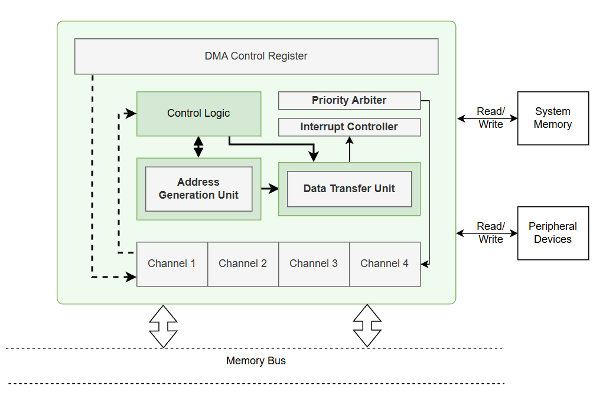

# Multi-Channel DMA Controller IP

## 1. Overview
This IP block is a Multi-Channel Direct Memory Access (DMA) Controller designed for high-performance data movement in a SoC. It enables efficient, autonomous memory-to-memory data transfers without tying up the CPU.

In the SoC, it acts as both a peripheral for the CPU to configure (via an AXI4-Full Slave interface) and a high-speed data mover (via an AXI4-Full Master interface) connected directly to the system crossbar.

It is needed to significantly increase system throughput by offloading bulk data transfers, freeing the CPU to focus on computational tasks and control logic while the DMA moves data in the background.

---

## 2. Features
- **Bus Interface**: Features dual AXI4-Full interfaces (one Slave for configuration, one Master for data transfer).
- **Master or Slave**: Both. Acts as a Slave to the CPU (typically mapped at `0x6001_0000`) and a Master (M3) on the system bus.
- **Key Capabilities**:
  - **4 Independent Channels**: Supports up to 4 parallel DMA transfers, each equipped with its own dedicated internal line buffer.
  - **Independent Round-Robin Arbitration**: Utilizes a round-robin arbiter that manages read and write buses independently, maximizing AXI outstanding transaction capabilities.
  - **Hardware Interrupts**: Per-channel interrupt generation (`irq_out`) to the PLIC to notify the CPU upon transfer completion or error.
  - **Sticky Status Registers**: Employs Write-1-to-Clear (W1C) logic for interrupt and status registers, preventing race conditions where short pulses might be missed by the CPU polling.

---

## 3. Block Diagram

- **AXI Slave (`dma_reg_slave`)**: Decodes configuration read/write transactions from the CPU and handles the memory-mapped register bank.
- **DMA Channels (`dma_channel`)**: 4 identical blocks, each managing its own source/destination pointers, transfer length, and a dedicated 64-byte line buffer.
- **Arbiter (`dma_arbiter`)**: Resolves conflicts when multiple channels request access to the shared read or write buses using round-robin scheduling.
- **AXI Master (`dma_axi_master`)**: Executes the physical AXI4 read and write burst transactions on the system crossbar.

---

## 4. Interface

### 4.1 Clock & Reset
- `clk`: System operating clock.
- `rst_n`: Active-low asynchronous reset.

### 4.2 Bus Interface
- **AXI4-Full Slave (`S_AXI_*`)**: Configures the DMA Controller. Connected to the system crossbar (typically Slave 11).
- **AXI4-Full Master (`M_AXI_*`)**: High-speed memory access bus. Connected to the system crossbar (typically Master 3).

### 4.3 Key Signals

| Signal | Direction | Description |
|--------|----------|-------------|
| `S_AXI_*` | Input/Output | AXI4-Full Slave signals for CPU configuration |
| `M_AXI_*` | Input/Output | AXI4-Full Master signals for data transfer |
| `irq_out` | Output | Interrupt request line, asserted when any channel is done or hits an error |
| `dma_busy_o` | Output | High when any of the 4 DMA channels are actively transferring data |

---

## 5. Register Map (if exists)

The DMA configuration is accessible via an AXI4-Full Slave mapped memory region (Base Address typically `0x6001_0000`). Each channel has a 16-byte (`0x10`) register footprint.

| Address | Name | Description |
|--------|------|-------------|
| `0x000` | `CH0_SRC` | [31:0] (RW) Source Address for Channel 0 |
| `0x004` | `CH0_DST` | [31:0] (RW) Destination Address for Channel 0 |
| `0x008` | `CH0_LEN` | [31:0] (RW) Transfer Length in bytes for Channel 0 |
| `0x00C` | `CH0_CTRL`| [3:0] (RW) Control: [0]=EN, [1]=START (Pulse), [3:2]=MODE |
| `0x010` | `CH1_SRC` | ... Same footprint for Channel 1 ... |
| `0x020` | `CH2_SRC` | ... Same footprint for Channel 2 ... |
| `0x030` | `CH3_SRC` | ... Same footprint for Channel 3 ... |
| `0x080` | `STATUS` | (RO / W1C for clear) [11:8]=Busy, [7:4]=Error, [3:0]=Done |
| `0x084` | `IRQ_EN` | [3:0] (RW) Enable interrupts per channel |
| `0x088` | `IRQ_STATUS` | [3:0] (W1C) Interrupt status flags. Write 1 to clear. |

**Software Usage:**
1. Configure `CHx_SRC`, `CHx_DST`, and `CHx_LEN`.
2. Configure `IRQ_EN` if interrupt-driven transfers are desired.
3. Write to `CHx_CTRL` to set `EN=1` and `START=1`.
4. Wait for the `irq_out` interrupt or poll the `STATUS` register.
5. Write `1` to the respective bit in `STATUS` (or `IRQ_STATUS`) to clear the sticky completion/error flag.

---

## 6. Internal Architecture

- **`dma_reg_slave`**: Provides the register interface to the CPU. It features sticky logic for 1-cycle pulses (like done/error signals from channels) so the CPU never misses an event. It also handles AXI handshake logic combinationally for zero-delay acceptances.
- **`dma_channel` (x4)**: The logical brains of each transfer. Tracks memory pointers, byte counts, and requests bus access from the arbiter when data is ready to push or space is available to pull.
- **`dma_arbiter`**: Round-robin logic. Separates read arbitration (`rd_req` -> `rd_grant`) from write arbitration (`wr_req` -> `wr_grant`), enabling full duplex memory access if supported by the crossbar.
- **`dma_axi_master`**: Transforms logical channel read/write requests into robust AXI4 protocol bursts, managing `AW`, `W`, `B`, `AR`, and `R` channels seamlessly.

---

## 7. Timing / Operation Flow

1. **Configuration**: CPU writes to the AXI Slave to set up addresses and lengths for a specific channel.
2. **Kickoff**: CPU writes the START bit. The channel asserts a read request (`rd_req`) to the arbiter.
3. **Arbitration**: The arbiter grants the read bus. The `dma_axi_master` issues AXI read bursts.
4. **Buffering**: Data returns from memory and is pushed into the channel's internal line buffer.
5. **Write Execution**: Once enough data is buffered, the channel requests the write bus (`wr_req`). The arbiter grants the write bus, and the `dma_axi_master` pushes data to the destination memory.
6. **Completion**: When the length counter hits 0, the channel asserts a 1-cycle `done` pulse. The `dma_reg_slave` latches this pulse, sets the sticky `STATUS` bit, and drives `irq_out` high.

---

## 8. Integration Guide
- Connect `S_AXI` to the SoC's peripheral crossbar.
- Connect `M_AXI` to the SoC's main memory crossbar (ensuring it has a path to both source and destination memory regions like DDR or SRAM).
- Connect `clk` and `rst_n` to the system domains.
- Connect `irq_out` to the Platform-Level Interrupt Controller (PLIC) so the firmware can efficiently handle DMA completion without active polling.

---

## 9. Limitations
- Channels use single 64-byte line buffers; performance may be sub-optimal if transferring heavily fragmented data spanning many non-contiguous short lengths.
- Relies on software to ensure source and destination addresses are correctly aligned according to the AXI burst size.
- Errors on the AXI bus (e.g., `DECERR`, `SLVERR`) halt the specific channel and generate an interrupt, requiring a software-initiated reset of the DMA to recover the channel.

---

## 10. Author
- Name: Đỗ Trần Chí Thắng
- Role: SoC Architecture, RTL Design, Verification, Firmware, Synthesis, FPGA Implementation
