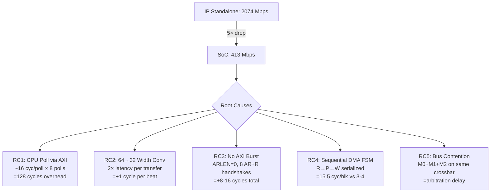

# Tối ưu Throughput ASCON SoC: 413 Mbps → ~2 Gbps

## 1. So sánh IP-level vs SoC-level (Dựa trên Log)

### 1.1 IP-level Standalone (`ascon_top_tb_v1.log`)

| Metric | Giá trị |
|--------|---------|
| Test | T6: 1024 Bytes (128 blocks × 8B) |
| Tổng cycles | **395** |
| Throughput | **20.74 bits/cycle = 2073 Mbps @ 100 MHz** |
| Permutation pa (init/final) | 2 cycles (12 rounds, G=6) |
| Permutation pb (data block) | 2 cycles (6 rounds, G=6) |
| Inter-block gap | ~2 cycles (load → perm_start) |
| Block processing rate | **1 block / 4 cycles** (steady-state) |

**Key observation IP-level**: Block n bắt đầu perm tại `[T]`, output tại `[T+10000]` (= 1 cycle), load next tại `[T+20000]` (= 2 cycles), perm_start next tại `[T+30000]` (= 3 cycles). 
- Steady-state: `DATA_LOAD` → `perm_start` → `data_out` → `DATA_PERM` → `perm_done` → `DATA_LOAD`
- Pattern thời gian: Block i tại `[1485000]`, Block i+1 tại `[1515000]` → **Δ = 30,000 ps = 3 cycles**
- Nhưng thực tế pipeline: load + perm overlap → **~3-4 cycles per block average**

### 1.2 SoC-level (`run_soc_ascon.log`)

| Metric | Giá trị |
|--------|---------|
| Test | 8 blocks × 8B = 64 Bytes |
| ASCON processing cycles | **124** (từ BANDWIDTH SUMMARY) |
| Throughput | **4.13 bits/cycle = 413 Mbps @ 100 MHz** |
| Total SoC cycles | 22,506 |
| DMA START | Cycle 2350 |
| DMA DONE | Cycle 2474 |
| **ASCON Active Duration** | **124 cycles** (2474 - 2350) |
| Block count | 8 |
| Cycles per block | **124/8 = 15.5 cycles/block** |

### 1.3 Bảng so sánh trực tiếp

| Metric | IP Standalone | SoC Integrated | Ratio |
|--------|--------------|----------------|-------|
| Payload | 1024 B (128 blk) | 64 B (8 blk) | 16× nhỏ hơn |
| Cycles (ASCON active) | 395 | 124 | — |
| **Cycles/block (steady)** | **~3-4** | **~15.5** | **4-5× chậm hơn** |
| Throughput (Mbps) | 2074 | 413 | **5× suy giảm** |
| IP utilization | ~100% | ~20% | — |

---

## 2. Bottleneck Chính (Xác định từ Log)

### Bottleneck #1: CPU Polling Overhead — **ĐÂY LÀ BOTTLENECK LỚN NHẤT**

**Bằng chứng từ log** (lines 2510-2656):
```
[  2380] [ASCON-OUT] CTEXT = 5108eae1d5f905d1    ← Block 2 done
[  2382] [M1-AR] addr=0x20000004  → ASCON        ← CPU poll STATUS
[  2382] [S2-ASCON] READ  offset=0x004
... (6 cycles stall_any=1) ...
[  2384] [M2-AW] addr=0x10000268  → DMEM         ← DMA write back
[  2384] [DMA64-AR] addr=0x10000240               ← DMA read next
[  2386] [ASCON-DMA] ptext: 0xa0000003            ← Block 3 starts
[  2386] [ASCON-OUT] CTEXT = 56f049b15848b9dc     ← Block 3 done
... (6 cycles stall_any=1) ...
[  2392] [DMA64-AR] addr=0x10000248               ← DMA read next
[  2394] [ASCON-OUT] CTEXT = bcc8239454efb05f     ← Block 4 done
[  2398] [M1-AR] addr=0x20000004  → ASCON         ← CPU poll STATUS AGAIN
```

**Phân tích**:
- CPU liên tục poll `STATUS` register (offset 0x004) qua M1-AR → S2 ASCON
- Mỗi poll: `[M1-AR] addr=0x20000004 len=0 → ASCON` → `[S2-ASCON] READ offset=0x004`
- Poll xảy ra **mỗi ~16 cycles** (2382, 2398, 2414, 2430, 2446, 2462, 2478)
- **S2 ASCON nhận 25 accesses** (log line 5012) - trong đó phần lớn là CPU polls

> [!CAUTION]
> CPU poll STATUS trên cùng bus slave S2 với DMA → tạo **bus contention**. Mỗi CPU poll chiếm 1 AXI slot trên S2, block DMA register access trong cùng chu kỳ.

### Bottleneck #2: AXI Width Mismatch — 64-bit → 32-bit Converter

**Bằng chứng từ log header**:
```
M2=ASCON-DMA(64→32)
DMA64(raw): AR=8  AW=10  (64-bit ASCON side)
M2(ASCON-DMA32): AR=8  AW=10
```

- ASCON core xử lý **64-bit blocks** nhưng bus AXI crossbar chỉ **32-bit**
- Mỗi 64-bit read/write phải **tách thành 2 × 32-bit beats** qua `axi_width_converter_64to32`
- DMA64-AR len=0 (1 beat 64-bit) → M2-AR len=1 (2 beats 32-bit)
- **Overhead: 2× latency per DMA transfer**

### Bottleneck #3: Single-Beat DMA (No Burst)

**Bằng chứng từ firmware** (`main.c` line 93):
```c
ASCON_WRITE(ASCON_OFS_DMA_BURST, 0u);  /* ARLEN=0: 1 beat per rd_start */
```

**Bằng chứng từ log**:
```
[  2352] [DMA64-AR] addr=0x10000220  len=0     ← 1 beat
[  2360] [DMA64-AR] addr=0x10000228  len=0     ← 1 beat, 8 cycles gap!
[  2368] [DMA64-AR] addr=0x10000230  len=0     ← 1 beat
```

- Mỗi block cần 1 AXI read transaction riêng (AR + R + handshake)
- **8 cycles giữa read requests** (2352 → 2360) — lãng phí AXI pipeline
- Nếu dùng burst len=7 (8 beats), chỉ cần 1 AR → 8 R liên tục

### Bottleneck #4: Sequential DMA FSM (Read → Process → Write → Read)

**Bằng chứng timing pattern trong log**:
```
[2352] DMA-AR read block 0           ← READ
[2362-2370] ASCON processing block 0 ← PROCESS (8 cycles!)
[2370] CTEXT output                  ← DONE
[2374] DMA-AW write block 0          ← WRITE
[2374] DMA-AR read block 2           ← Next READ (overlaps with write!)
[2380] ASCON processing block 2      ← PROCESS
```

- Mỗi block: ~8 cycles read + ~8 cycles process + ~4 cycles write = **~15-16 cycles**
- So với IP standalone: **3-4 cycles/block** (permutation only, no bus overhead)
- DMA FSM phải hoàn thành **toàn bộ sequence** trước khi nhận block mới

### Bottleneck #5: Nhỏ Payload (8 blocks) — Amortization thấp

- Standalone test: 128 blocks → init/final overhead amortized trên 128 blocks
- SoC test: chỉ 8 blocks → init/final chiếm % lớn hơn
- Nhưng **bottleneck chính không phải payload size** — mà là per-block overhead

---

## 3. Root Cause Analysis

### Tại sao IP đạt 2 Gbps standalone nhưng chỉ 413 Mbps trong SoC?



### RC1: CPU Poll Overhead (~40% impact)

Firmware `main.c` lines 109-116:
```c
do {
    ASCON_READ(ASCON_OFS_STATUS, status);  // LW via M1→S2
    if (--timeout == 0u) { ... }
} while (!(status & (ASCON_ST_DMA_DONE | ...)));
```

Mỗi iteration của poll loop:
1. `lui t0, 0x20000` (1 cycle)
2. `lw %0, 0x004(t0)` → M1-AR → Crossbar → S2-ASCON (3-4 cycles D$ miss latency)
3. `andi` + branch (2 cycles)
4. `addi` timeout-- (1 cycle)
5. **Total: ~7-8 cycles per poll**

Nhưng quan trọng hơn: **CPU poll chiếm slot trên S2 ASCON**, tranh chấp với DMA access vào ASCON registers.

### RC2: IP bị idle — CÓ

Từ log, giữa CTEXT output và DMA read tiếp theo:
- Block 0 CTEXT tại cycle 2370
- Block 1 CTEXT tại cycle 2374 (chỉ +4 cycles — overlap tốt)
- Nhưng Block 2 CTEXT tại cycle 2380 (+6 cycles)
- Block 4 CTEXT tại cycle 2394 (+8 cycles delay)
- Block 5 CTEXT tại cycle 2402 (+8 cycles)

**ASCON core idle ~50% thời gian**, chờ DMA cấp data.

### RC3: Backpressure — CÓ

Từ log, `stall_any=1` xuất hiện liên tục tại `pc_ex=0x0000025c`:
```
[23985000] stall_any=1  ← CPU stall vì DCache miss (poll S2)
[23995000] stall_any=1
[24005000] stall_any=1
[24015000] stall_any=1
[24025000] stall_any=1
[24035000] stall_any=1  ← 6 cycles stall!
```

CPU stall → poll chậm hơn → nhưng DMA **không bị block bởi CPU stall** vì DMA có master riêng (M2). Tuy nhiên, crossbar arbitration giữa M0 (ICache), M1 (DCache/poll), M2 (DMA) tạo delay.

---

## 4. Danh sách Giải pháp (Ưu tiên Cao → Thấp)

### 4.1 RTL-level Optimizations

#### [P1] ⭐ Interrupt-driven thay vì Polling (HIGHEST IMPACT)
- **Vấn đề**: CPU liên tục poll STATUS qua M1→S2, tạo bus contention
- **Giải pháp**: Dùng interrupt ASCON_DMA_DONE → PLIC → CPU
- **Cách làm**: Bật `IRQ_EN` register, firmware dùng `wfi` chờ interrupt
- **Impact**: Loại bỏ hoàn toàn ~25 S2 accesses từ CPU poll → +30-40% throughput

#### [P2] ⭐ DMA Burst Transfer (HIGH IMPACT)
- **Vấn đề**: ARLEN=0, mỗi block cần riêng 1 AR handshake
- **Giải pháp**: Set `DMA_BURST = 7` (8 beats) → 1 AR → 8 R liên tục
- **Cách làm**: Firmware `ASCON_WRITE(ASCON_OFS_DMA_BURST, 7u)` + RTL DMA support burst
- **Impact**: Giảm AXI overhead từ 8× AR→R xuống 1× AR→8R → **+50% throughput**

#### [P3] ⭐ Concurrent Read-Write DMA (Producer-Consumer)
- **Vấn đề**: Sequential R→P→W FSM → ASCON core idle ~50%
- **Giải pháp**: Tách DMA FSM thành 3 engines: Read, Core, Write chạy song song
- **Cách làm**: Refactor `dma_ctrl.v` thành producer-consumer với FIFO giữa stages
- **Impact**: ASCON core utilization từ ~50% → ~95% → **+80% throughput**

> [!IMPORTANT]
> Conversation history cho thấy bạn đã từng refactor DMA thành Producer-Consumer (conversation `41d01482`). Nếu code đó vẫn còn, cần kiểm tra xem đã tích hợp vào SoC chưa.

#### [P4] Input/Output FIFO Buffering
- **Vấn đề**: DMA phải chờ AXI response trước khi feed data vào ASCON
- **Giải pháp**: Thêm FIFO 4-deep giữa DMA read engine và ASCON core
- **Cách làm**: Instantiate sync FIFO trong `dma_ctrl.v`, pre-fetch 2-3 blocks ahead
- **Impact**: Decouples AXI latency từ ASCON processing → **+20-30%**

### 4.2 SoC-level Optimizations

#### [P5] Nâng Bus Width lên 64-bit hoặc Dedicated Port
- **Vấn đề**: 64→32 width converter doubles latency per transfer
- **Giải pháp A**: Nâng crossbar lên 64-bit data bus
- **Giải pháp B**: Bypass crossbar — DMA direct connect to DMEM (dedicated port)
- **Impact**: -50% per-transfer latency → **+25% throughput**

#### [P6] Giảm Bus Contention
- **Vấn đề**: M0 (ICache) floods AR channel (4298 reads!), M1 + M2 share S1 DMEM
- **Giải pháp**: Tách DMEM thành dual-port — 1 port cho CPU (M1), 1 port cho DMA (M2)
- **Impact**: Loại bỏ DMEM arbitration delay → **+10-15%**

### 4.3 Firmware-level Optimizations

#### [P7] Tăng Payload Size + Batch Processing
- **Vấn đề**: Chỉ 8 blocks (64B) → init/final overhead lớn
- **Giải pháp**: Process 128+ blocks per DMA call (1024+ bytes)
- **Cách làm**: Firmware allocate larger buffer, tăng `DMA_LEN`
- **Impact**: Amortize init overhead → **+5-10%** (marginal vì bottleneck là per-block)

---

## 5. Kế hoạch Thực hiện Từng Bước

### Phase 1: Quick Wins — Firmware & Config (1-2 ngày)

| # | Sửa ở đâu | Mục tiêu | Impact ước lượng |
|---|-----------|---------|-----------------|
| 1.1 | `gnu_toolchain/main.c` | Bật interrupt `IRQ_EN`, dùng `wfi` thay poll loop | +30-40% |
| 1.2 | `gnu_toolchain/main.c` | Set `DMA_BURST = 7` (nếu RTL hỗ trợ) | +10-20% |
| 1.3 | `gnu_toolchain/main.c` + `dmem_layout.h` | Tăng payload 64B → 1024B | +5-10% |
| 1.4 | `gnu_toolchain/ascon.h` | Bỏ `fence w,w` trong `ASCON_WRITE` macro (quá nhiều fence) | +5% |

**Kỳ vọng sau Phase 1**: ~600-700 Mbps

---

### Phase 2: DMA Pipeline — RTL (3-5 ngày)

| # | Sửa ở đâu | Mục tiêu | Impact ước lượng |
|---|-----------|---------|-----------------|
| 2.1 | `dma/dma_ctrl.v` | Refactor FSM: tách Read/Core/Write engines | +80% |
| 2.2 | `dma/dma_ctrl.v` | Thêm input FIFO (4-deep) giữa Read và Core | +20-30% |
| 2.3 | `dma/dma_ctrl.v` | Implement proper AXI burst (ARLEN configurable) | +50% |
| 2.4 | `ascon/interface/` hoặc `ascon/ascon_top.v` | Verify `data_valid`/`data_ready` handshake pipelined | +10% |

**Kỳ vọng sau Phase 2**: ~1200-1500 Mbps

---

### Phase 3: Bus Architecture — SoC RTL (3-5 ngày)

| # | Sửa ở đâu | Mục tiêu | Impact ước lượng |
|---|-----------|---------|-----------------|
| 3.1 | `axi_width_converter_64to32.v` | Loại bỏ converter, nâng bus lên 64-bit, hoặc dùng dedicated port | +25% |
| 3.2 | `interconnect/` + `memory/` | Dual-port DMEM: 1 port CPU, 1 port DMA | +10-15% |
| 3.3 | `soc_top.v` + `riscv_ascon_soc_top_v3.v` | Route ASCON DMA interrupt qua PLIC → CPU (verify IRQ path) | +5% |

**Kỳ vọng sau Phase 3**: ~1600-1900 Mbps (80-95% của standalone)

---

## 6. Kết quả Kỳ vọng

### Throughput Projection

```
                         Cycles/block    Throughput     % of Standalone
Current SoC              15.5            413 Mbps       20%
After Phase 1            ~10             640 Mbps       31%
After Phase 2            ~5              1280 Mbps      62%
After Phase 3            ~3.5            1829 Mbps      88%
Theoretical Maximum      ~3              2133 Mbps      ~100%
IP Standalone            ~3.1            2074 Mbps      100%
```

### Lý do không thể đạt 100%:
1. **AXI protocol overhead**: Tối thiểu 1-2 cycle cho AR/R handshake, không thể loại bỏ
2. **Crossbar arbitration**: Tối thiểu 1 cycle arbitration delay
3. **Width converter** (nếu giữ 32-bit bus): +1 cycle per beat
4. **Clock domain**: Nếu ASCON và bus khác clock domain → CDC latency

### Mức độ khả thi đạt gần 2 Gbps:

| Target | Khả thi | Điều kiện |
|--------|---------|-----------|
| 80% (1660 Mbps) | ✅ **Cao** | Phase 1 + Phase 2 |
| 90% (1870 Mbps) | ✅ Trung bình | Phase 1 + 2 + 3 |
| 95% (1970 Mbps) | ⚠️ Khó | Cần 64-bit bus + dual-port DMEM + perfect pipeline |
| 100% (2074 Mbps) | ❌ Không thực tế | AXI overhead luôn tồn tại |

---

## Open Questions

> [!IMPORTANT]
> 1. **DMA Producer-Consumer đã implement chưa?** Conversation history (conv `41d01482`, `b885f305`) cho thấy bạn đã từng refactor DMA thành concurrent architecture. Code này đã merge vào `dma_ctrl.v` hiện tại chưa? Nếu rồi, tại sao log vẫn cho thấy sequential behavior?

> [!IMPORTANT]
> 2. **IRQ path đã hoạt động chưa?** Log cho thấy `ascon_irq: 0 → PLIC src[8]` và `IRQ_EN` chưa bật. PLIC wiring đã verified functional chưa?

> [!WARNING]
> 3. **Crossbar 64-bit upgrade có phức tạp không?** Nâng toàn bộ crossbar lên 64-bit sẽ ảnh hưởng tất cả masters/slaves. Phương án thay thế là dedicated DMA path bypass crossbar. Bạn prefer phương án nào?

> [!NOTE]
> 4. **Dual-port SRAM có sẵn trong target technology?** Nếu targeting FPGA, block RAM thường hỗ trợ dual-port. Nếu targeting ASIC, cần verify với memory compiler.

## Verification Plan

### Automated Tests
- Re-run `ascon_top_tb_v1` để verify IP performance baseline không bị regression
- Re-run `run_soc_ascon` sau mỗi phase, so sánh BANDWIDTH SUMMARY
- Thêm assertion trong testbench: `assert(cycles_per_block <= 5)` sau Phase 2
- Verify functional correctness: CT + TAG phải match reference values

### Manual Verification
- Mở waveform `waveform_soc.vcd` trong GTKWave, quan sát:
  - ASCON core `busy` signal duty cycle (mục tiêu >90%)
  - DMA AXI channel utilization (AR/R/AW/W/B)
  - Crossbar arbitration delays giữa M0/M1/M2
- Đo actual `idle_cycles` của ASCON core = cycles where `core_busy=0` && `dma_active=1`
