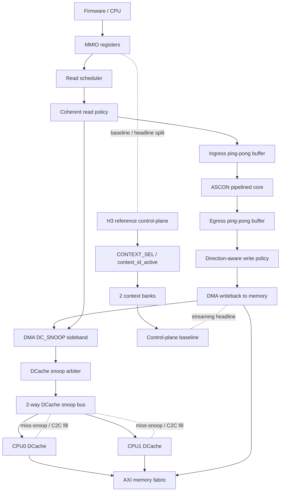

# Sơ Đồ Kiến Trúc H

Tài liệu này là sơ đồ kiến trúc chốt cho nhánh `H`.

## Luồng đọc

1. Firmware cấu hình register và chọn mode.
2. Read scheduler phát động đường đọc theo policy coherent.
3. Ingress ping-pong che latency bộ nhớ và cho phép overlap.
4. ASCON core xử lý theo pipeline.
5. Egress buffer giữ kết quả để write policy quyết định đường ghi.
6. H3 chỉ giữ vai trò reference control-plane cho context switching.

## DCache coherence fabric

Trong RTL hiện tại, DCache không còn chỉ là cache riêng lẻ cần firmware tự flush toàn bộ trước/sau DMA. SoC đã có một lớp coherence sideband rõ ràng:

- ASCON DMA phát `DC_SNOOP_*` để đọc dữ liệu mới nhất từ DCache hoặc invalidate output line theo policy.
- `dcache_snoop_arb_3to1` gom request từ DMA và các đường miss-snoop nội bộ.
- `dcache_snoop_bus_2way` phân phối snoop tới CPU0/CPU1 DCache theo mask đang active.
- Mỗi DCache có sideband snoop controller, có thể trả line hit, invalidate line, và hỗ trợ miss-snoop/C2C fill.
- Tag array dùng trạng thái kiểu `I/S/E/M`, nhưng khi viết báo cáo nên gọi an toàn là `MESI-like state tracking` thay vì claim full MESI protocol nếu chưa đóng hết regression corner-case.

## Thông điệp kiến trúc

- `H3` là baseline cho control-plane.
- `Dot C` là baseline payload datapath.
- `H` là streaming coherent datapath có overlap thật.
- Điểm khác biệt cần nhấn mạnh là `direction-aware DMA-DCache coherence`: read side ưu tiên snoop để lấy dữ liệu mới, write side chọn giữa output non-temporal/performance và invalidate fallback tùy `DMA_COH_CTRL`.
